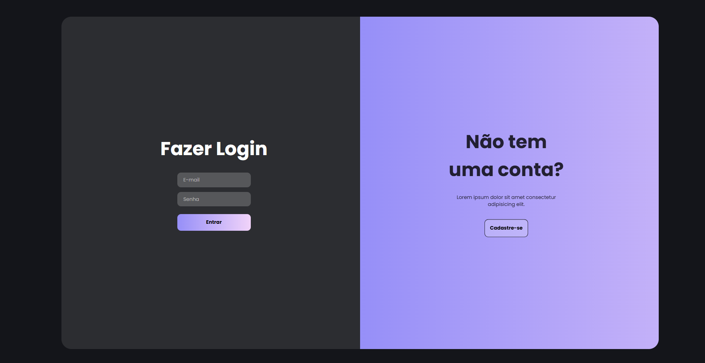

# 🌀 Formulário Interativo Animado - Login & Cadastro

Projeto criado com foco em **interface moderna**, **animações suaves** e **experiência do usuário aprimorada**. Desenvolvido em HTML, CSS e JavaScript, este formulário alterna dinamicamente entre as telas de **login** e **cadastro**, inspirado no vídeo do canal [Gustavo Campelo - Desenvolvedor](https://www.youtube.com/watch?v=as_rZNjjbUQ).

---

## 📌 Sobre o Projeto

Este projeto tem como objetivo demonstrar como construir uma interface de autenticação com animações visuais que tornam a navegação mais fluida e envolvente para o usuário.

---

## 🚀 Funcionalidades

✅ Transição animada entre login e cadastro  
✅ Validação básica de campos com JavaScript  
✅ Layout totalmente responsivo  
✅ Estilo moderno com HTML e CSS puros  
✅ Fácil de personalizar e integrar em outros projetos

---

## 🎯 Tecnologias Utilizadas

- **HTML5** – Estrutura da página
- **CSS3** – Estilização e animações
- **JavaScript (puro)** – Interação e manipulação do DOM

---

## 📂 Estrutura do Projeto

```
📁 formulario-animado/
├── 📄 index.html # Página principal com login e cadastro
├── 📄 style.css # Estilos visuais e animações
└──  📄 script.js # Lógica JS para alternar entre formulários
```

---

## 📸 Captura de Tela




---

## 📸 Prévia do projeto

(https://neginterprises.github.io/Formul-rio-Interativo-Animado-de-Login-e-Cadastro-com-HTML-CSS-e-JavaScript/)

---

Desenvolvido com 💻 por N&G Enterprises
---
Autores: 
Gabriel Vanço Gandolfi
<br>
Natiele Nogueira de Paula

---

## ✍️ Créditos
Este projeto foi inspirado no conteúdo do canal Gustavo Campelo - Desenvolvedor, que ensina programação de forma prática e acessível.

---

## 📃 Licença
Este projeto está licenciado sob a MIT License.
Sinta-se livre para usar, estudar, modificar e compartilhar! 🎉